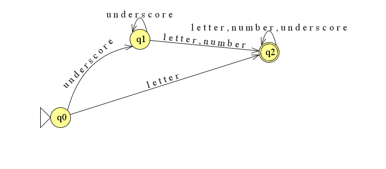
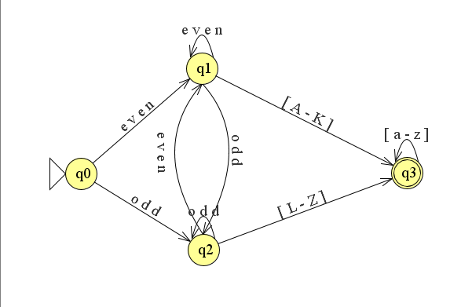
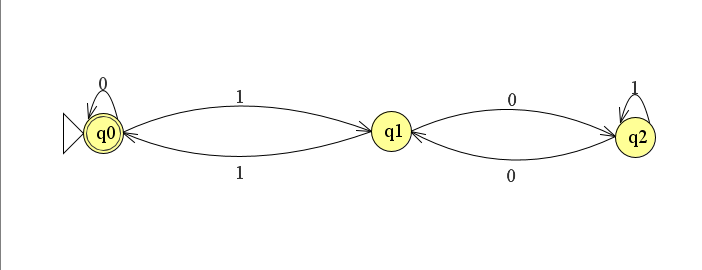
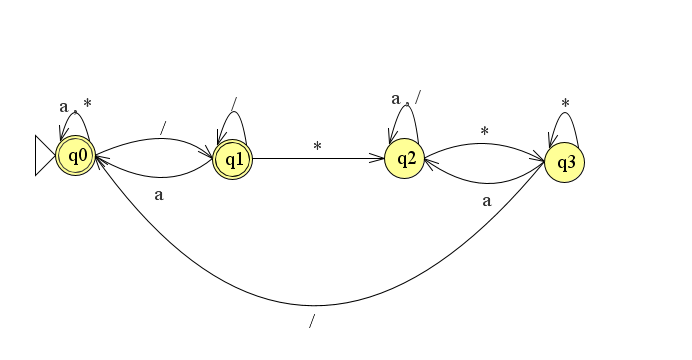

# DFAs
In this folder there are a series of various Deterministic Finite Automata created by myself, some just for have a rough idea of how an advanced automata should work and some to be re-used in the Lexers that will follow in other sections

### ThreeZeros DFA
This particular DFA recognizes all the strings which contains in any position at least three 0 one after the other.

The DFA **NotThreeZeros** is the one which recognizes the strings which do not contain three 0, one after another, in any position. The graphic representation is not reported because it's easily obtained from that of the original dfa.

### Identifiers
This DFA recognizes a simple language of identifiers in which: an identifier is a sequence (NOT EMPTY) of letters, numbers and the symbol underscore, which does not start with a number and cannot be made using only underscores.

### Matricola
This particular DFA must recognize a specific type of 'Matricola' (sequence of numbers followed by a string representing a surname, usually used to identify a student): it must recognized those with number EVEN and surname starting with [A-K], and those with number ODD and surname starting with [L-Z].
The number can have a length of 1 to undefined.
A surname is a sequence of letters (Starting with an uppercase one) and cannot containt any special char. For this particular dfa we are ignoring cases of composed surnames.

### MatricolaWithSpaces
This DFA must recognize the same type of matricolas above with the exception that now they can also have any number of spaces (also zero) before and after, and also between the sequence of number and the surname. 
This automata must also accept composed surname remembering that in that case each part must start with an uppercase letter ("1234 De Blasio" must be accepted but "1234 De blasio" must not)

### MatricolaReversed
This DFA must recognize the same language as **Matricola** but now the surname preceeds the sequence of numbers (note in this dfa spaces are not allowed).

### MultiplesOfThree
Very simple DFA capable of recognizing any binary number which is multiple of three (note: the easy solution consinst on recognizing its remainder)

### OnlyComments
This DFA, on the alphabhet {/, \*, a}, recognizes all the strings of comments which start with \/\* and end with  \*\/.
Note that the minimum correct comment is the string \/\*\*\/ because \/\*\/ is not a comment.

### InputAndComments
This DFA can also have string of characters (a) before and after a comment, and zero or more than one comment on the same string.

